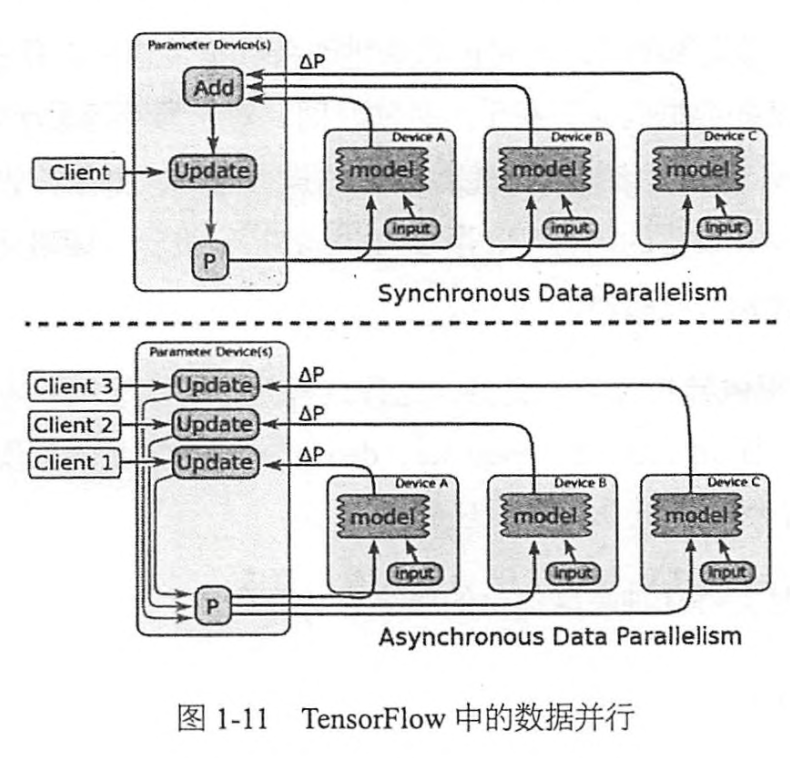
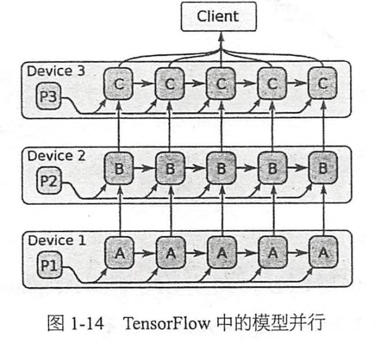

# Chapter1 TF基础
## 1.1 TF概要
**数据交换框架** <<-->>**Protobuf**
**编译工具** <<-->> **Bazel**
TF是一个 **有向图**(**directed graph**),每个运算操作(**operation**)作为一个节点(**node**),节点和节点之间为边(**edge**)。计算图中每一个节点可以有任意多个输入和任意多个输出，每个节点描述了一种运算操作，节点可以算是运算操作的实例化(**instance**).在**edge**中流动 **flow** 的数据被称为 张量( **tensor** ),故得名TensorFlow.**tensor**可以事先定义，也可以根据计算图的结构推断得出。有一类的边中没有数据流动，这种边称为 依赖控制(**control dependencies**),作用是让它的起始节点执行完之后再执行目标节点，用户可以使用这样的边进行灵活的条件控制，比如限制内存使用的最高峰值。

## 1.2 TF三种不同的加速神经网络训练的并行计算模式
1. **数据并行**：将一个mini-bath的数据放在不同的设备上计算，实现梯度计算的并行化。比如将有1000条样本的mini-batch拆分成10份100条样本的数据并行计算，完成后将10份梯度数据合并得到最终梯度并更新到共享的参数服务器(parameter server).这样的操作会产生完全一样的子图的副本，在client上可以用一个线程同步控制这些副本运算的循环。

上述这个操作还可以改成异步的，使用多个线程控制梯度的计算，每个线程计算完后异步地更新模型参数。

2. **模型并行**：将计算图的不同的部分放在不同的设备上运算，实现简单的模型并行，起目标在于减少每一轮训练迭代的时间，不同于数据并行同时进行多份数据的训练，模型并行需要模型本身有大量可以并行，且互不依赖或者依赖程度不高的子图。在多GPU上的限制主要在PCIe的带宽，在多机之间的限制主要在网络开销。

3. **流水线并行**：和异步的数据并行很像，只不过是在同一个硬件设备上实现并行。

