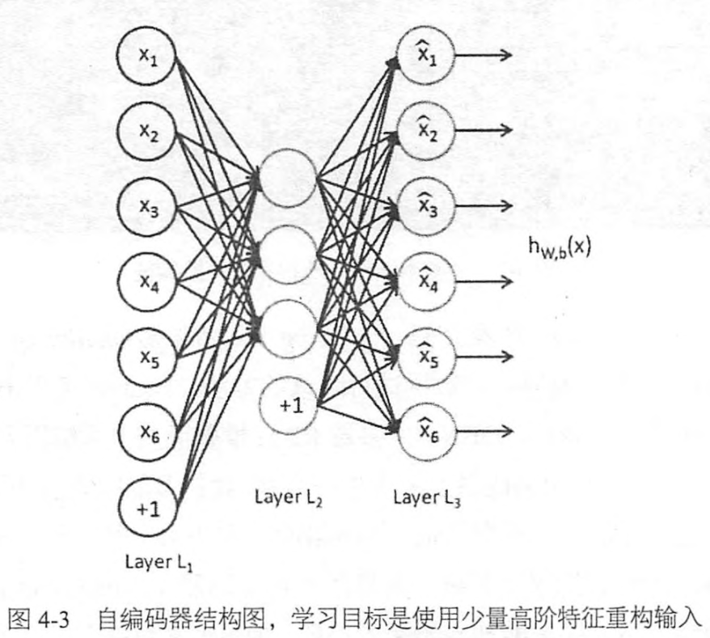

# Chapter4 TF实现自编码器和多层感知机
## 4.1 自编码器简介
稀疏编码(Sparse Coding),特征的稀疏表达，使用少量的基本特征组合拼装得到更高层抽象的特征。自编码器(AutoEncoder)，可以使用自身的高阶特征编码自己。Hinton提出了基于深度信念网络(Deep Belief Networks,DBN,由多层RBM堆叠而成)可使用无监督的逐层训练的贪心算法。


自编码器的输入节点和输出节点的数量是一致的，自编码器通常希望使用少量稀疏的高阶特征来重构输入，所以加入几种限制，
1. 如果限制中间隐含层节点的数量，比如让中间隐含层节点的数量小于 输入/输出节点的数量，就相当于一个降维的过程。此时已经不可能出现复制所有节点的情况，如果再给中间隐含层的权重添加一个L1的正则，则可以根据惩罚系数控制隐含层节点的稀疏程度，惩罚系数越大，学到的特征组合越稀疏，实际使用(非零权重)的特征数量越少。
2. 给数据加入噪声，那么就是Denoising AutoEncoder(去噪自编码器)，我们将从噪声中学习数据的特征，不可能完全复制节点，唯有学习数据频繁出现的模式和结构，将无视规律的噪声略去，才可以复原数据。

## 4.2 TF实现自编码器
我们自编码器会使用到一种参数初始化方法 xavier initialization,如果深度学习模型的权重初始化得太小，那信号将在每层间传递时逐渐缩小而难以产生作用，但如果权重初始化得太大，那信号将在每层间传递时逐渐放大并导致发散和失效。而 Xaiver初始化器就是让权重被初始化得不大不小，正好适合。就是让 权重满足0均值，方差为 $\frac{2}{n_{i n}+n_{o u t}}$，分布可以用均匀分布或者高斯分布。
```python
def xavier_init(fan_in,fan_out,constant =1):
    low = -constant * np.sqrt(6.0/(fan_in+fan_out))
    high = constant*np.sqrt(6.0 / (fan_in + fan_out))
    return tf.random_uniform(
        (fan_in,fan_out),minval=low,maxval=high,detype=tf.float32)
```
通过 tf.random_uniform 创建了矩阵[fan_in,fan_out],fan_in是输入节点，fan_out 是输出节点，范围在 $\left(-\sqrt{\frac{6}{n_{i n}+n_{o u t}}}, \sqrt{\frac{6}{n_{i n}+n_{o u t}}}\right)$内的均匀分布，方差$D(x) = (max-min)^2/12 = \frac{2}{n_{i n}+n_{o u t}}$.
下面定义一个去噪自编码的class。
```python
import numpy as np 
import sklearn.preprocessing as prep
import tensorflow as tf 
from tensorflow.examples.tutorials.mnist import input_data

def xavier_init(fan_in,fan_out,constant =1):
    low = -constant * np.sqrt(6.0/(fan_in+fan_out))
    high = constant*np.sqrt(6.0 / (fan_in + fan_out))
    return tf.random_uniform(
        (fan_in,fan_out),minval=low,maxval=high,detype=tf.float32)

class AdditiveGaussianNoiseAutoencoder(object):
    def __init__(
        self,n_input,n_hidden,transfer_function = tf.nn.softplus,
        optimizer = tf.train.AdamOptimizer(),scale=0.1):
        '''
        n_input:输入变量数
        n_hidden:隐含层节点数
        transfer_function：隐含层激活函数
        optimizer：优化器
        scale：高斯噪声系数
        '''
        self.n_input = n_input
        self.n_hidden = n_hidden
        self.transfer = transfer_function
        self.scale = tf.placeholder(tf.float32)
        self.training_scale = scale
        network_weights = self._initialize_weights()
        self.weights = network_weights

        '''
        接下来定义网络结构，为输入x创建一个维度为n_input的palceholder.然后建立一个能提取特征的隐含层，先将输入
        x加上噪声，经过隐含层后，在输出层进行数据复原，重建。这里不需要激活函数。
        '''
        self.x = tf.placeholder(tf.float32,[None,self.n_input])
        self.hidden = self.transfer(tf.add(tf.matmul(
            self.x + scale* tf.random_normal((n_input,)),self.weights['w1']),self.weights['b1']
        ))
        self.reconstruction = tf.ass(tf.matmul(self.hidden,self.weights['w2']),self.weights['b2'])

        '''
        接下来定义自编码器的损失函数，直接直接使用平方误差作为cost，
        '''
        self.cost = 0.5*tf.reduce_sum(tf.pow(tf.subtract(self.reconstruction,self.x)),2.0)
        self.optimizer = optimizer.minimize(self.const)

        init = tf.global_variables_initializer()
        self.sess = tf.Session()
        self.sess.run(init)


    def _initialize_weights(self):
        '''
        创建一个名为 all_weights 的字典，
        '''
        all_weights = dict()
        all_weights['w1']  = tf.Variable(xavier_init(self.n_input,self.n_hidden))

        all_weights['b1'] = tf.Variable(tf.zeros[self.n_hidden],dtype=tf.float32)

        all_weights['w2'] =  tf.Variable(tf.zeros[self.n_input],dtype = tf.float32)

        all_weights['b2'] = tf.Variable(tf.zeros[self.n_input],dtype = tf.float32)

        return all_weights
    
    def partial_fit(self,X):
        '''
        定义计算损失cost及执行一步训练的函数partial_fit.函数里只需让Session执行两个计算图的节点，分别是cost和训练过程
        optimizer,输入的feed_dict包括输入数据x，以及噪声系数scale,函数parital_fit做的就是用一个batch数据进行训练并返回
        当前的损失cost
        '''
        cost,opt = self.sess.run(
            (self.cost, self.optimizer),feed_dict={self.x:X,self.scale:self.training_scale})
        return cost

    def calc_total_cost(self,X):
        '''
        需要一个只求损失cost的函数，这里就只让session执行一个而计算图节点self.cost,传入的参数和前面的 partial_fit一致，
        这个函数是在自编码器训练完毕后，在测试数据集上对模型性能进行评测时会用到，不会像partial_fit那样触发训练操作
        '''
        return self.sess.run(self.cost,feed_dict = {self.x:X,self.scale:self.training_scale})
    
    def transform(self,X):
        '''
        我们还定义了transform函数，它返回自编码器隐含层的输出结果，它的目的是提供一个接口来获取抽象后的特征，自编码器的隐含层的
        最主要的功能就是学习出数据中高阶特征
        '''
        return self.sess.run(self.hidden,feed_dict={self.x:X,self.scale:self.training_scale})
    
    def generate(self,hidden=None):
        '''
        将隐含层的输出结果作为输入，通过之后的重建层将提取到的该节特征复原为原始数据，这个接口和前面的transform正好将整个
        自编码器拆分为两部分，这里的generate结构是后半部分，将高阶特征复原为原始数据的步骤
        '''
        if hidden is None:
            hidden = np.random.normal(size = self.weights["b1"])
        return self.sees.run(self.reconstruction,feed_dict={self.hidden:hidden})
    
    def reconstruct(self,X):
        '''
        定义resconstruct函数，它整体运行一遍复原过程，包括提取高阶特征和通过高阶特征复原数据，即包括transform和generate
        .输入数据是元数据，输出数据是复原后的数据
        '''
        return self.sess.run(self.reconstruction,feed_dict = {self.x:X,self.scale:self.training_scale})

    def getWeights(self):
        return self.see.run(self.weights['w1'])

    def getBiases(self):
        return self.sess.run(self.weights['b1'])

```
```python
#接下来使用tf载入mnist数据集
mnist = input_data.read_data_sets('MNIST_data',one_hot=True)


def standard_scale(X_train,X_test):
    '''
    标准化数据，变为0均值，1标准差，先减去均值，再除以标准差，
    '''
    preprocessor = prep.StandardScaler().fit(X_train)
    X_trian = preprocessor.transform(X_train)
    X_test = preprocessor.transform(X_test)
    return X_train,X_test

def get_random_block_from_data(data,batch_size):
    '''
    获取随机block数据的函数，属于不放回抽样，可以提高数据的利用效率
    '''
    start_index = np.random.randint(0,len(data)-batch_size)
    return data[start_index:(start_index+batch_size)]

#使用之前的函数对训练集和测试集进行标准化变换
X_train,X_test= standard_scale(mnist.train.images,mnist.test.images)

n_samles = int(mnist.train.num_examples)
training_epoches = 20
batch_size = 128
deisplay_step = 1

'''
创建一个AGN自编码的实例，定义模型输入节点数n_input 784. 自编码器的隐含层节点数 n_hidden 200
隐含层的激活函数 transfer_function ->softplus,优化器Adam,学习率0.001，噪声scale 0.01
'''
autoencoder = AdditiveGaussianNoiseAutoencoder(
    n_input =784,
    n_hidden = 200,
    transfer_function = tf.nn.softplus,
    optimizer = tf.train.AdamOptimizer(learning_rate = 0.001),
    scale = 0.01
    )

'''
在每一轮epoch循环开始时，将平均损失avg_cost设为0，并计算总共需要的 batch数(样本数目/batch)，注意这里使用的是不妨
会抽样，不能保证每个样本参与训练。在每个batch中，用 get_random_block_from_data 随机抽取一个 block的数据，然后使用
partial_fit 训练整个 batch的数据并计算当前的cost,最后将当前的cost整合到 avg_cost中，可以通过调整 batch_szie,epoch,
优化器，自编码器的隐含层数、隐含节点数等，来获取更低的 cost
'''

for epoch in range(training_epoches):
    avg_cost = 0.
    total_batch = int(n_samles/batch_size)
    for i in range(total_batch):
        batch_xs = get_random_block_from_data(X_train,batch_size)

        cost = autoencoder.partial_fit(batch_size)
        avr_cost +=cost/n_samles*batch_size

    if epoch % deisplay_step ==0:
        print("Epoch",'%04d'%(epoch+1),"cost={:.9f}".format(avg_cost))
    
print("Total cost " + str(autoencoder.calc_total_cost(X_test)))
```
去噪之编码器在数据输入时做了标准化，并加上了一个高斯噪声，输出结果不是数字分类结果，而是复原的数据，因此不需要用标注过的数据进行监督训练。它不是对数据进行聚类，而是提取其中最有用的、最频繁出现的高阶特征，

## 4.3 多层感知机简介

