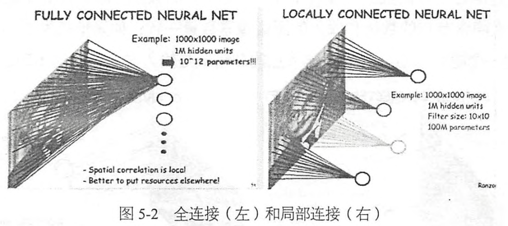

# Chapter5 TF实现卷积网络
卷积神经网络(Convolutional Neural Network,CNN)也可以用于时间序列信号，比如音频信号和文本数据。CNN的最大特点在于卷积的 **权值共享结构**，可以大幅减少神经网络的参数量，防止过拟合的同时又降低神经网络模型的复杂度。
一个卷积层中可以又多个不同的卷积核，而每一个卷积核都对应一个滤波后映射出的新图像，同一个新图像中每一个像素都来自完全相同的卷积核，这就是卷积核的权值共享。降低模型复杂度，减轻过拟合并降低计算量。假设土拍你尺寸1000\*1000，黑白，数据维度为 100万，连接一个相同大小的隐含层(100万个隐含节点)，连接数为100万\*100万=一万亿。

假设局部感受野大小是10\*10，那么现在就只需要10\*10*100万 = 1亿个连接。如果是卷积操作，不论图像多大，都是这10\*10=100个参数，即卷积核的尺寸。一般来说100个卷积核放在第一层卷积层就很充足了。那么参数量就是100\*100=1万个。每一个卷积层提取的特征，在后面的层中都会抽象组合成更高阶的特征。虽然需要训练的参数量下降了，但是隐含节点的数量只和卷积的步长有关。如果步长为1，那么隐含节点的数量和输入的图像像素数量一致；如果步长为5，那么隐含节点的数量就是输入象素数量的1/25

## 5.1 Lenet-5结构
LeNet5的诸多特性依然在state-of-art卷积神经网络中使用，