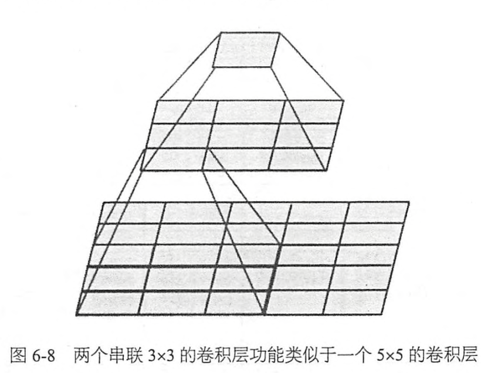
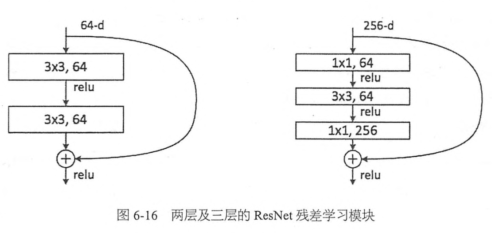

# Chapter6 TF实现经典卷积网络
## 6.1 AlexNet
1. 成功使用 **RELU** 作为CNN的激活函数，并验证其效果在较深的网络超过 **Sigmoid** ,成功解决了Sigmoid在网络较深时的 **梯度弥散**问题。
2. 训练时使用 Dropout随机忽略一部分神经元，以避免模型过拟合。
3. 在CNN中使用重叠的最大池化，此前CNN中普遍使用平均池化，AlexNet全部使用最大池化，避免了平均池化的模糊化效果，并且AlexNet中提出让 **步长**比 **池化核**的尺寸小，这样池化层的输出之间会有重叠和覆盖，提升了特征的丰富性。
4. 提出了 **LRN**层，对局部神经元的活动创建竞争机制，使得其中响应比较大的值变得相对更大，并抑制其他反馈较小的神经元，增强了模型的泛化能力。
5. 使用CUDA加速深度卷积网络的训练，利用GPU强大的并行计算能力，
6. 数据增强，随机第从256\*256的原始图像中截取 224\*224大小的区域。进行预测时，则是取图片的四个角加中间共5个位置，并进行左右翻转，一共获得10张图片，对它们进行预测并对10次结果求均值。同时对图像的RGB数据进行PCA处理，并对主成分做一个标准差为0.1的高斯扰动，增加一些噪声，这个 Trick可以再让错误率下降1%。

## 6.2 VGGNet
VGGNet是牛津大学计算机视觉组和Google DeepMind公司的研究员一起研发的深度卷积神经网络。VGGNet探索了卷积神经网络的深度与其性能之间的关系，通过反复堆叠3\*3的小型卷积核和2\*2的最大池化层，VGGNet成功地构筑了16~19层深的卷积神经网络，
两个3\*3的卷积层串联相当于1个5\*5的卷积层，即一个像素会和周围5\*5的像素产生关联，可以说感受野大小为5\*5.而3个3\*3的卷积层串联的效果则相当于1个7\*7的卷积层，除此之外，3个串联的3\*3的卷积层，拥有比1个7\*7的卷积层更少的参数狼量，3\*3\*3 / 7\*7 = 55%，3个3\*3的卷积层拥有比1个7\*7的卷积层更多的非线性变化(可以使用3次ReLU激活函数)，使得CNN对特征的学习能力更强。

VGGNet在训练时有一个小技巧，先训练级别A的简单网络，在复用A网络的权重来初始化后面的几个复杂的模型，这样训练收敛的速度更快，在预测时，VGG采用Multi-Scale的方法，将图像scale到一个尺寸Q,并将图片输入卷积网络计算。然后在最后一个卷积层使用滑窗的方式进行分类预测，将不同滑窗的分类结果平均，再将不同尺寸Q的结果平均得到最后结果。VGGNet还是用了 Multi-Scale 的方法做数据增强，将原始图像缩放到不同尺寸S,然后再随机裁剪 244*244 的图片，这样能增加很多数据量，对于防止模型过拟合有很不错的效果。实践中，作者令S在[256，512]这个区间内取值，并将多个版本的数据合在一起进行训练。
1. LRN层作用不大
2. 越深的网络效果越好
3. 1\*1的卷积也是很有效的，但是没有 3\*3的卷积好，大一些的卷积核可以学习更大的空间特征

## 6.3 Inception Net
Inception V1参数少但效果好：
1. 模型层深，表达能力更强， 
2. 去除了最后的全连接层，用全局平均池化层(即将图片变为1\*1)来取代他，全连接层几乎占据了AlexNet或VGGNet中90%的参数量，而且会引起过拟合，去除全连接层后模型训练更快并且减轻了过拟合。用全局平均池化层取代全连接层的做法借鉴了 Network In Network(NIN)论文。
3. Inception V1,中精心设计的Inception Module提高了参数利用率，如下图

这部分也借鉴了NIN的思想，形象的解释就是Inception Module本身如同大网络中的一个小网络，其结构可以反复堆叠在一起形成大网络。不过Inception V1比NIN更进一步的是增加了分支网络，NIN则主要是级联的卷积层和MLPConv层，一般来说卷积层要提升表达能力，主要依靠增加输出通道数 ，但副作用是计算量增大和过拟合，每一个输出通道对应一个滤波器，同一个滤波器共享参数，只能提取一类特征，因此一个输出通道只能做一种特征处理。
Inception Module第一个分支对输入进行 1-1的卷积，1-1的卷积是一个非常优秀的结构，它可以跨通道组织信息，提高网络的表达能力，同时可以对输出通道升维和降维。可以看到Inception Module的4个分支都用到了 1-1卷积，来进行低成本计算(计算量比 3-3小很多)的跨通道的特征变化。第二个分支先使用了1-1卷积，然后连接3-3卷积，相当于进行了两次特征变换。Inception Module中包含了3种不同尺寸的卷积和一个最大池化。1-1卷积，用很小的计算量就能增加一层特征变换和非线性化。使用不同尺寸的 Gabor滤波器处理不同尺寸的图片。
人脑神经元的连接是稀疏的，稀疏结构是非常适合神经网络的一种结构，尤其是对非常大型，非常深的神经网络，可以减轻过拟合并降低计算量，例如卷积神经网络就是稀疏的连接。Inception Net的主要目标就是找到最优的稀疏结构单元(Inception Module),论文中提到其稀疏结构基于 Hebbian原理：神经反射活动的持续时间与重复会导致神经元连接稳定性的持久提升，当两个神经元细胞A和B距离很近，并且A参与了对B重复、持续的兴奋，那么某些代谢变化会导致A将作为能使B兴奋的细胞，即“一起发射的神经元会连接在一起”，学习过程中的刺激会使神经元的突触强度增加。受到 Hebbian 原理启发，另一篇文章 “ Provable Bounds for learning Some Deep Representations ”提出，如果数据集的概率分布可以被很大很稀疏的神经网络所表达，那么构筑这个网络的最佳方法是逐层构筑网络：将上一层高度相关(correlated)的节点聚类，并将聚类出来的每一个小簇(cluster)连接到一起，如下图，这个相关性高的节点应该被连接在一起的结论，就是对 Hebbian的原理有效性的证明。

因此一个好的稀疏结构，应该将相关性高的一簇神经元节点连接在一起。在普通的数据集中，可能需要对神经元节点聚类，但是在图片数据中，天然的就是临近区域的数据相关性高，因此相邻的像素点被卷积操作连接在一起。而我们可能有多个卷积核，在同一空间位置但在不同通道的卷积核的输出结果相关性极高。因此，一个1-1的卷积既可以很自然地把这些相关性很高的，在同一个空间位置但是不同通道的特征连接在一起，这就是为什么1-1卷积那么频繁地被应用到 InceptionNet中的原因。1-1卷积所连接的节点的相关性最高，而稍微大点的卷积(3-3,5-5)卷积所连接的节点相关性也很高，因此也可以适当地使用一些大尺寸的卷积，增加多样性(diversity).
在Inception Module中，1-1卷积的比例最高(输出通道占比)，我们希望靠后的Inception Module可以步骤更高阶的抽象特征，因此靠后的Inception Module的卷积空间集中度应该逐渐降低，这样可以捕获更大的面积的特征。**因此，越靠后的Inception Module，3-3和5-5这两个大面积的卷积核的占比(输出通道数)应该更多。**
Inception Net有22层深，除了最后一层输出，其中间节点的分类效果也很好。因此，**使用了 辅助分类节点(auxiliary classifiers),**，即将中间某一层的输出用作分类，并按一个较小的权重(0.3)加到最终分类结果中，这样相当于做了模型融合，同时给网络增加了反向传播的梯度信号，也提供了额外的正则化，对于整个模型有利。

## 6.4 Inception V2
Inception V2学习了VGGNet,用两个3-3的卷积替代了5-5的大卷积(用以降低参数量并减轻过拟合)，**还提出了著名的 Batch Normalization(BN)，BN**是一个非常有效的正则化方法，可以让大型卷积网络的训练速度加快很多倍，同时收敛后的分类准确率也可以得到大幅提高。**BN** 用于神经网络某层时，会对每一个 mini-batch数据的内部进行标准化(normalization)处理，使输出规范化到 N(0,1)的正态分布，减小了 Internal Covariate Shift(内部神经元分布的改变)。**BN**的论文指出，传统的深度神经网络在训练时，每一层的输入的分布都在变化，导致训练变得困难，我们只能使用一个很小的学习速率解决这个问题。而对每一层使用BN之后，我们就可以有效地解决这个问题。学习速率可以增大很多倍，达到之前的准确率所需要的迭代次数只有 1/14.因为BN某种意义上还起到了 正则化的作用，所以可以减小或者取消 Dropout,简化 网络结构。
当然，只是单纯的使用BN获得的增益还不够明显，还需要一些相应的调整：增大学习率并加快学习衰减速度以适用BN规范化后的数据；去除Dropout并减轻L2正则(因为Bn已经起到了正则化的作用)；去除LRN;更彻底地对训练样本进行shuffle；减小数据增强对数据的光学畸变(因为BN训练更快，每个样本被训练的次数更少，因此更真实的样本对训练更有帮助)。

## 6.5 Inception V3
1. 引入了 Factorization into small convolutions的思想，将一个较大的二维卷积拆成两个较小的一维卷积，比如将7-7卷积拆成1-7卷积和 7-1卷积，或者将3-3卷积拆成1-3卷积和3-1卷积，一方面节约了大量参数，加速运算并减轻过拟合(比将7-7卷积拆成1-7卷积和7-1卷积，比拆成3个3-3卷积更节约参数)。同时增加了一层非线性扩展模型表达能力，论文指出，这种非对称的卷积结构拆分，其结果比对称地拆为几个相同的小卷积核效果更明显，可以处理更多，更丰富的空间特征，增加特征多样性。
2. Inception V3 优化了 Inception Module 的结构，现在Inception Module有35-35，17-17，8-8三种不同结构，这些只在网络的后部出现，前部还是普通的卷积层。 并且InceptionV3除了在Inception Module中使用分支，还在分支中使用了分支(8-8的结构中)，可以说是 Network In Network In Network.

## 6.6 ResNet
ResNet(Residual Neural Network),瑞士教授提出 **Highway Network**,原理与ResNet很相似，**Highway Network**的目标就是解决极深的神经网络难以训练的问题，**Highway Network**相当于修改了每层的 **激活函数**。此前的激活函数只是对输入做了一个非线性变换 $y=H\left(\mathrm{x}, \mathrm{W}_{\mathrm{H}}\right)$,**Highway Network**则允许保留一定比例的原始输入x，即 $y=H\left(\mathrm{x}, \mathrm{W}_{\mathrm{H}}\right) \cdot T\left(\mathrm{x}, \mathrm{W}_{\mathrm{T}}\right)+\mathrm{x} \cdot C\left(\mathrm{x}, \mathrm{W}_{\mathrm{C}}\right)$，其中T为变换系数，C为保留系数，论文中令 C= 1-T.这样前面一层的信息，有一定比例可以不经过 **矩阵乘法** 和 **非线性变换**，直接传输到下一层，仿佛一条信息高速公路，因此得名 **Highway Network**.

**Highway Network**主要通过 **gating units学习如何控制网络中的信息流，即学习原始信息应保留的比例**。这个可学习的gating机制，正是借鉴自瑞士教授早年的LSTM循环神经网络中的 gating.几百乃至上千深的Highway Network可以直接使用梯度下降算法训练，并可以配合多种非线性激活函数，

ResNet和HighWay Network非常相似，**也是允许原始输入信息直接传输到后面的层中**，ResNet最初的灵感来自:在不断加深神经网络的深度时，会出现 **Degradation**的问题，**即准确率会先上升然后达到饱和，再持续增加深度则会导致准确率下降**，这并不是一个过拟合的问题，因为不光在测试集上误差增大，训练集本身误差也会增大。假设有一个比较浅的网络达到了饱和的准确率，那么后面再加上几个y=x的全等映射层，起码误差不会增加，即更深的网络不应该带来训练集上误差上升。而这里提到的使用 **全等映射**直接将前一层输出到后面的思想，就是ResNet的灵感来源。

假设某段神经网络的输入是x，期望输出是 H(x)，如果我们直接把输入x传到输出作为初始结果，那么此时我们需要学习的目标就是 F(x) = H(x) -x .

ResNet最大的区别是，有很多旁路的支线将输入直接连接到后面的层，使得后面的层可以直接学习残差，这种结构也被称为 shortcut 或 skip connections.

在使用了 **ResNet的结构后，可以发现层数不断增加导致的训练集上误差增大的现象被消除了**，

